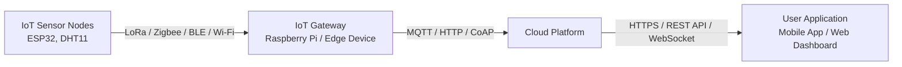

# Q39. What is an IoT Gateway?

An **IoT gateway** is a device that acts as an intermediary between IoT sensor nodes and the cloud. It collects data from multiple sensors, performs tasks such as data filtering, protocol conversion, and security, and then forwards the processed data to cloud servers. IoT gateways reduce network traffic, improve reliability, and enable communication between devices using different protocols.

## System Architecture

## Protocols Used at Each Layer

| Layer | Typical Protocols |
|--------|-------------------|
| **IoT Sensor Nodes → Gateway** | Zigbee, LoRa, Bluetooth Low Energy (BLE), Wi-Fi |
| **Gateway → Cloud** | MQTT, HTTP/HTTPS, CoAP |
| **Cloud → User Application** | HTTPS, REST API, WebSocket |
